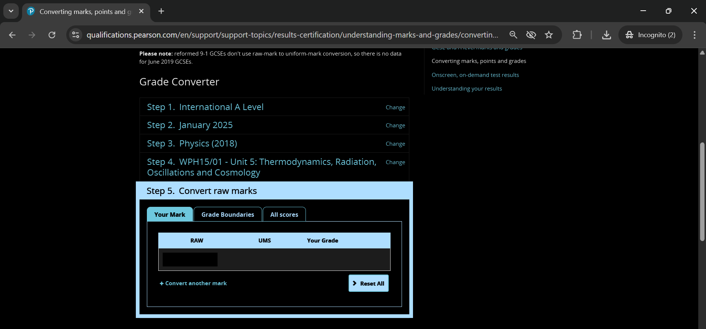
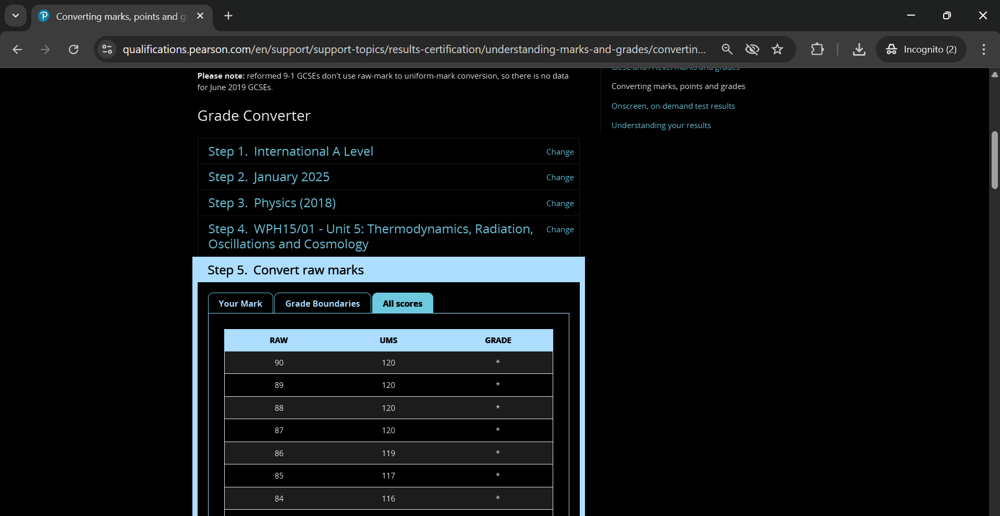
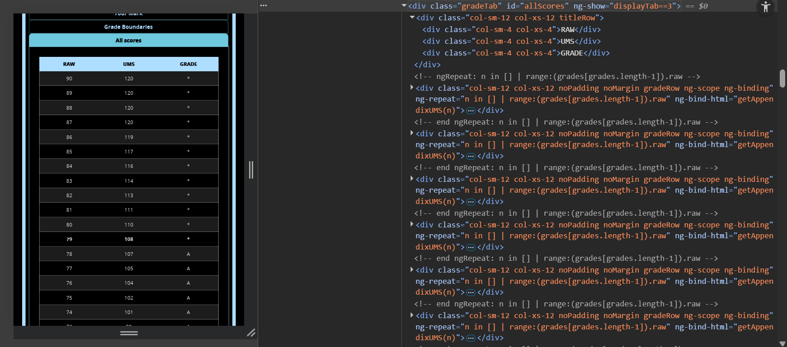
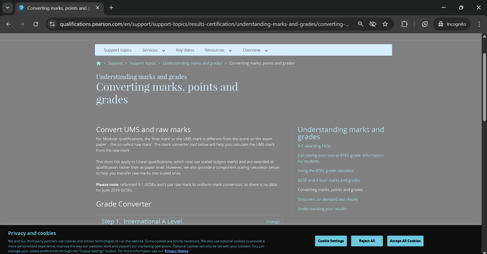

## Page Analysis
- This _Convert raw marks_ region is what I'll be referring to as "converter"

- To get to all the data we go into the _All Scores_ tab
    - Which happens to be a table, which we can decode by checking out the HTML
    
## HTML Analysis

- A div with the id **allScores** contains all the required rows of data
- Each row itself is also a div 
- The row divs further contain 3 more divs (the columns) with the text
- It's essentially like:
    ```html
    <div id="allScores">
        <div class="row">
            <div class="column1">Text</div>
            <div class="column1">Text</div>
            <div class="column1">Text</div>
            <!-- 3 columns of data for every row -->
        </div>
        <!-- ...More Rows -->
    </div>
    ```
## Link Analysis
 - The Link to _converter_: https://qualifications.pearson.com/en/support/support-topics/results-certification/understanding-marks-and-grades/converting-marks-points-and-grades.html?QualFamily=International%20A%20Level&ExamSeries=_**Year**_&Qualification=_**Subject Name**_&Unit=_**Unit Name**_

- From this we can see that to reach the converter we need to supply to 3 endpoints:
    - Year
    - Subject Name
    - Unit Name
## My Approach
1. Made a `years.txt` file that contains all the latest (new specification) years for the <strong>Year</strong>, _ExamSeries_ endpoint
2. Made a `Subjects` directory which contains txt files with names corresponding to the <strong>Subject Name</strong>, _Qualification_ endpoint
3. Made each txt file have all the available units for the <strong>Unit Name</strong>, _Unit_ endpoint
4. Finally all I need to do is loop over 
    ```yaml
    → each Subject 
        → each unit 
            → each year
    ```
## Application
- Open `batch.py` and follow along
#### Web Scraping
- Used **Selenium** with Chrome Web Drivers to scrape
- When Selenium first loads Chrome, it's a new session, so we are asked for permission to accept cookies
    - The _Accept All Cookies_, i.e. `accept_btn` in the code, is fetched by its id and clicked so that it doesn't appear in the following GET requests
    
- Then the looping begins and we fetch the _converter_ page each time, then I fetch the link for _All Scores_ tab, i.e. `all_scores_link`, and click it to access the table
- Finally, the table's child div's texts are extracted
    - I stored each row's, each column as an array
    - And each row as an array as well as an array
    - eg: `rows =[[text1, text2, text3], [text1, text2, text3], ..more_rows]`
#### Storing Data
- Used **Polars** to store the data as JavaScript Objects accordingly
## Summary
```yaml
Edexcel Charts
└─── Subjects : Lists all the subjects
        └─── Biology (2018).txt
        └─── Chemistry (2018).txt
        └─── Further Mathematics.txt
        └─── Mathematics.txt
        └─── Pure Mathematics.txt
        └─── Physics (2018).txt
        - The txt files contain the corresponding units that are to be scraped
└─── batch.py : Can use this to scrape all the listed subjects automatically
└─── single.py : Need to manually input a particular link where you have filled in the data till the actual converter
└─── years.txt : Lists all the years to be scraped
```
